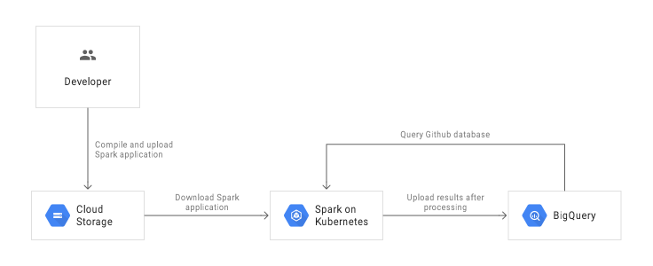

# Submitting Applications to minikube

## Docker Images

Kubernetes requires users to supply images that can be deployed into containers within pods. The images are built to be run in a container runtime environment that Kubernetes supports. Docker is a container runtime environment that is frequently used with Kubernetes. Spark (starting with version 2.3) ships with a Dockerfile that can be used for this purpose, or customized to match an individual application’s needs. It can be found in the kubernetes/dockerfiles/ directory.

Spark also ships with a bin/docker-image-tool.sh script that can be used to build and publish the Docker images to use with the Kubernetes backend.

Example usage is:


```
cd /usr/local/Cellar/apache-spark/2.4.0/libexec
./bin/docker-image-tool.sh -m -t v2.4.0 build
```

## Submit spark app on kubernetes on cluster mode

To get cluster infos, 
```
kubectl cluster-info
```

To launch Spark Pi in cluster mode,

```
spark-submit \
--master k8s://https://192.168.99.100:8443 \
--deploy-mode cluster \
--name spark-pi \
--class org.apache.spark.examples.SparkPi \
--conf spark.executor.instances=3 \
--conf spark.kubernetes.container.image=spark:v2.4.0 \
local:///opt/spark/examples/jars/spark-examples_2.11-2.4.0.jar
```

# Submitting Applications to Google Kubernetes Engine (GKE)

<p align="center">
  
</p>


Build the sample application jar:

```
mvn clean package
```


Upload the application jar to the Cloud Storage bucket:

```
gsutil cp target/bigquery-commits-1.1-SNAPSHOT-jar-with-dependencies.jar \
                gs://$PROJECT-spark-on-k8s/jars/
```

Specify context : 

```
kubectl config get-contexts
kubectl config use-context gke_spark-k8s-gcp_us-central1-f_spark-on-gke  
```

Add authorization for Spark to launch jobs in the Kubernetes cluster
```
kubectl create clusterrolebinding user-admin-binding --clusterrole=cluster-admin --user=$(gcloud config get-value account)
kubectl create clusterrolebinding --clusterrole=cluster-admin --serviceaccount=default:default spark-admin
```


To launch Spark Pi in cluster mode,

```
export KUBERNETES_MASTER_IP=$(gcloud container clusters list --filter name=spark-on-gke --format='value(MASTER_IP)')
spark-submit \
--master k8s://https://$KUBERNETES_MASTER_IP:443 \
--deploy-mode cluster \
--name spark-pi \
--class org.apache.spark.examples.SparkPi \
--conf spark.executor.instances=3 \
--conf spark.kubernetes.container.image=eu.gcr.io/spark-k8s-gcp/spark:v2.4.0 \
local:///opt/spark/examples/jars/spark-examples_2.11-2.4.0.jar

```


Run the Spark *github commits* application on GKE :

```
export KUBERNETES_MASTER_IP=$(gcloud container clusters list --filter name=spark-on-gke --format='value(MASTER_IP)')
bin/spark-submit \
--properties-file properties-bq-commits \
--deploy-mode cluster \
--class spark.bigquery.example.commits.BigQueryCommitCountToBigQuery \
--master k8s://https://$KUBERNETES_MASTER_IP:443 \
--jars http://central.maven.org/maven2/com/databricks/spark-avro_2.11/4.0.0/spark-avro_2.11-4.0.0.jar \
gs://$PROJECT-spark-on-k8s/jars/bigquery-commits-1.1-SNAPSHOT-jar-with-dependencies.jar \
spark-k8s-gcp:spark_on_k8s.sample_commits spark-k8s-gcp:spark_on_k8s.commits_count

```

